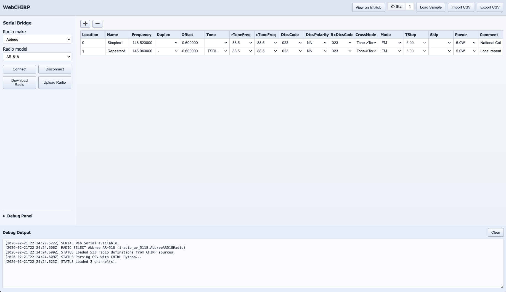
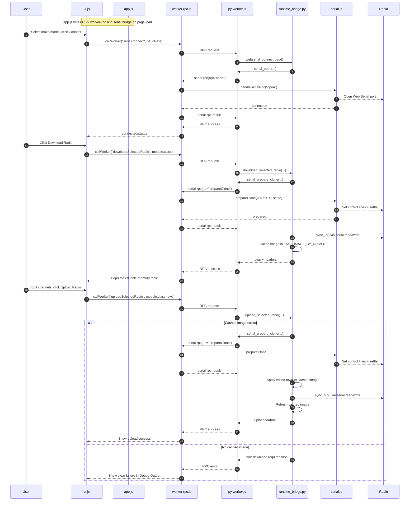

# webchirp 📻

Prototype for running parts of [CHIRP](https://github.com/kk7ds/chirp) in the browser with a CHIRP-like UI.

# This is live and running on [codeplug.org](https://codeplug.org)



## What is implemented

- `chirp` is included as a git submodule at `/Users/jps/github/webchirp/chirp`
- Browser UI with a channel-memory table inspired by CHIRP
- Python runtime in-browser (Pyodide) running CHIRP code (`generic_csv` driver)
- CSV import/parse via CHIRP Python code
- CSV export/normalization via CHIRP Python code
- Web Serial bridge (browser serial in JS, called from Python in Pyodide)
- Python-driven TX/RX serial transaction path (`serialConnect`, `serialTxRx`)
- Radio make/model dropdowns populated from CHIRP driver source files
- Selection-aware download/upload actions using selected CHIRP clone-mode driver

## Run the prototype

From `/Users/jps/github/webchirp`:

```bash
python -m http.server 8000
```

Open [http://localhost:8000/web/index.html](http://localhost:8000/web/index.html).

Serial access requires a browser with Web Serial support and a secure context
(`http://localhost` works).

For radio cloning:

1. Choose `Radio make` and `Radio model` from dropdowns (loaded from CHIRP sources).
2. Click `Connect` (baud is prefilled when available from selected driver).
3. Click `Download Radio` to read channels into the table.
4. Edit values and click `Upload Radio` to write back.

## Command-line hardware test (UV-5R flow)

You can run the serial hardware regression sequence from Node.js using the
local `chirp/` checkout and the `serialport` package:

```bash
npm run test:hw -- --port /dev/tty.usbserial-XXXX
```

Optional flags:

- `--module uv5r` (default)
- `--class BaofengUV5R` (default)
- `--baud 9600` (auto-uses driver BAUD_RATE when omitted)
- `--post-clone-delay-ms 3000` (wait after clone operations for radio reboot)

The test sequence is:

1. Download current radio image and save it to a temporary backup file.
2. Erase all channels.
3. Upload a synthetic PMR446 channel plan.
4. Download again and verify readback matches the synthetic rows.
5. Restore the original backup image in a `finally` block (even on failure).

## Architecture

- Frontend: `/Users/jps/github/webchirp/web/index.html` + `/Users/jps/github/webchirp/web/app.js`
- Python worker bridge: `/Users/jps/github/webchirp/web/py-worker.js`
- Versioned Python runtime code (loaded by worker): `/Users/jps/github/webchirp/web/python/runtime_bridge.py`
- CHIRP source loaded into Pyodide FS directly from the submodule:
  - `/chirp/chirp/__init__.py`
  - `/chirp/chirp/chirp_common.py`
  - `/chirp/chirp/directory.py`
  - `/chirp/chirp/drivers/generic_csv.py`
  - and required dependencies (`errors.py`, `util.py`, `memmap.py`)

## Important scope note

This MVP proves in-browser execution of CHIRP Python logic for file-backed workflows.

Live browser serial now attempts to execute the selected CHIRP clone-mode
driver (`sync_in`/`sync_out`) through a generalized pyserial-like bridge.
Compatibility still depends on driver expectations and browser transport limits.

## Sequence diagram (sketch) of how it all works


